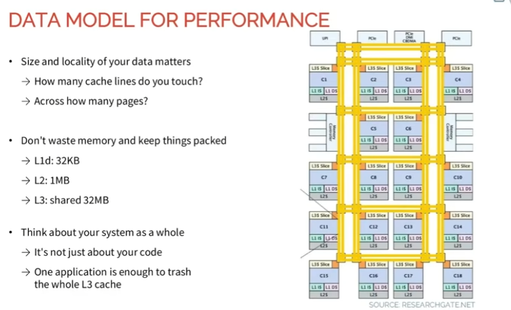

# Low-Latency C++：Data Model、Hot Path 与 Cache Locality

这两页内容连起来讲的是同一个核心问题：

> **Low-latency performance 不能只靠最后找一个慢函数来优化；data
> model、memory layout 和 hot path 必须从设计阶段就考虑性能。**

------------------------------------------------------------------------

## 1. Story of a Smart Algo That Wanted to Be Fast


Slide 的核心内容：

-   If the data model hasn't been thought with performance in mind...
-   It will be slow "everywhere"
-   Profiling will be underwhelming: no clear bottleneck
-   "Everything is in the hotpath"

### 1.1 `It will be slow "everywhere"`

假设交易系统的数据模型从一开始就是：

``` cpp
struct Order {
    std::string symbol;
    std::string exchange;
    std::map<std::string, double> fields;
};

std::list<Order> orders;
```

hot path 到处都可能发生：

``` text
copy Order
dynamic allocation
string operation
map lookup
pointer chasing
cache miss
```

这时候问题不是某一个 function 特别慢，而是**整个数据访问方式都不适合 low
latency**。

CPU 可能不断经历：

``` text
load pointer
   ↓
cache miss
   ↓
wait for memory
   ↓
load another pointer
   ↓
cache miss
   ↓
dynamic allocation
   ↓
...
```

因此系统表现成 `slow everywhere`。

### 1.2 `Profiling will be underwhelming: no clear bottleneck`

理想情况下 profiler 可能显示：

``` text
Function A    65% CPU   ← clear bottleneck
Function B    10%
Function C     5%
```

那么优化 Function A 就可能得到明显提升。

但是如果根本问题来自整个 data model：

``` text
Function A     8%
Function B     7%
Function C     6%
Function D     5%
Function E     5%
...
```

就没有一个特别明显的函数。

真正的成本可能分散在：

``` text
pointer chasing
cache misses
allocation
copying
bad memory layout
```

例如：

``` cpp
std::list<Order> orders;
```

每个 node 可能散落在 heap 的不同位置：

``` text
RAM

[Order A]                  [Order D]

          [Order B]

                             [Order C]
```

遍历逻辑虽然只是：

``` cpp
for (auto& order : orders) {
    process(order);
}
```

但 CPU 可能不停等待 memory。

相比之下：

``` cpp
std::vector<Order> orders;
```

通常更加连续：

``` text
[Order A][Order B][Order C][Order D]
```

因此有更好的 cache locality。

### 1.3 `"Everything is in the hotpath"`

Hot path 指：

> **从收到关键输入到产生关键输出之间，必须同步完成的那条
> latency-sensitive 路径。**

Trading system 中可以简单理解成：

``` text
Market Data
    ↓
OrderBook Update
    ↓
Strategy
    ↓
Risk Check
    ↓
Order
```

不应该随便把所有工作都塞进去。例如：

``` cpp
void onMarketData(const MarketData& md) {
    updateBook(md);

    writeLogToDisk(md);      // 不应该阻塞 hot path
    updateDatabase(md);      // 不应该阻塞 hot path
    sendGUIUpdate(md);       // 不应该阻塞 hot path

    calculateStrategy(md);
}
```

这样会变成：

``` text
Market Data
    ↓
OrderBook
    ↓
Disk
    ↓
Database
    ↓
GUI
    ↓
Strategy
    ↓
Order
```

也就是 `"Everything is in the hotpath"`。

更合理的思想是：

``` text
                    ┌──→ Logging
                    ├──→ Monitoring
Market Data ────────┼──→ GUI
    │               └──→ Analytics
    ▼
Strategy
    ↓
Risk
    ↓
Order
```

真正必须在下单之前完成的事情留在 hot
path；其他事情尽量异步或者移出关键路径。

------------------------------------------------------------------------

# 2. Data Model for Performance



这一页把上一页的 `data model for performance` 具体化成两个核心概念：

> **Size + Locality**

也就是：

1.  数据有多大？
2.  数据在 memory 中是否集中？

------------------------------------------------------------------------

## 3. How many cache lines do you touch?

CPU 通常不会只从 memory 读取一个 `int`，而是按照 **cache line**
搬运数据。

典型 cache line：

``` text
64 bytes
```

例如：

``` cpp
struct Order {
    int id;        // 4 bytes
    int price;     // 4 bytes
    int quantity;  // 4 bytes
    int side;      // 4 bytes
};                 // roughly 16 bytes
```

如果使用：

``` cpp
std::vector<Order> orders;
```

连续的四个 Order 大致可能位于同一个 64-byte cache line：

``` text
64-byte cache line

┌────────┬────────┬────────┬────────┐
│Order 0 │Order 1 │Order 2 │Order 3 │
│ 16B    │ 16B    │ 16B    │ 16B    │
└────────┴────────┴────────┴────────┘
```

CPU 处理 `Order 0` 时，整个 cache line 会被加载进 cache，因此后面的
Order 1/2/3 很可能已经在 cache 中。

这就是 **spatial locality**。

如果使用：

``` cpp
std::list<Order>
```

node 可能散落在不同位置：

``` text
Order0 ─────────────→ Order1
                         │
      Order3 ←──────── Order2
```

遍历时可能：

``` text
Order0 → cache miss
Order1 → cache miss
Order2 → cache miss
Order3 → cache miss
```

所以 low-latency performance 不只是：

``` text
O(n) vs O(log n)
```

还要考虑：

> **为了完成这次计算，到底 touch 了多少 cache lines？**

------------------------------------------------------------------------

# 4. Across how many pages?

Cache line 再往上一层，可以考虑 memory page。

典型情况：

``` text
int
 ↓
4 bytes

cache line
 ↓
64 bytes

memory page
 ↓
4 KB
```

一个 page 中包含很多 cache lines：

``` text
Page 1 = 4 KB

┌─────────────────────────────────────────┐
│64B│64B│64B│64B│64B│ ...                │
└─────────────────────────────────────────┘
```

程序通常使用 virtual address：

``` text
Virtual Address
      ↓
Address Translation
      ↓
Physical Address
```

CPU 使用 **TLB (Translation Lookaside Buffer)** 缓存最近的 page
translation：

``` text
virtual page → physical page
```

如果 hot data 非常分散：

``` text
Data A → Page 1
Data B → Page 839
Data C → Page 1923
Data D → Page 87
```

就不仅可能造成 cache miss，也会增加 TLB pressure，甚至发生 TLB miss。

因此：

``` text
How many cache lines do you touch?
        +
Across how many pages?
```

实际上都在问：

> **为了完成一次关键计算，CPU 到底需要访问多少不同的 memory
> locations？**

------------------------------------------------------------------------

# 5. Don't waste memory and keep things packed

假设：

``` cpp
struct Order {
    int id;
    int price;
    int quantity;

    char symbol[128];
    char clientName[128];
    char description[256];

    int strategyId;
};
```

但是 Strategy 的 hot path 实际只需要：

``` text
price
quantity
side
```

那么 CPU 每次读取 Order 时，都可能顺便把大量 hot path 根本不用的数据带进
cache。

``` text
Order
──────────────────────────────
price        ← HOT
quantity     ← HOT
side         ← HOT

symbol       ← COLD
clientName   ← COLD
description  ← COLD
metadata     ← COLD
──────────────────────────────
```

可以考虑拆开：

``` cpp
struct HotOrderData {
    int price;
    int quantity;
    int side;
};

struct ColdOrderData {
    std::string symbol;
    std::string clientName;
    std::string description;
};
```

hot path 访问的数据就可以更加紧凑：

``` text
[price qty side][price qty side][price qty side]...
```

这种思想叫：

> **Hot / Cold Data Separation**

目标是让 CPU cache 中尽量保存真正频繁使用的数据。

------------------------------------------------------------------------

# 6. L1 / L2 / L3 Cache

Slide 给出的示例：

``` text
L1d: 32 KB
L2 : 1 MB
L3 : shared 32 MB
```

具体大小取决于 CPU，不需要死记数字。

重要的是层级：

``` text
             小 / 快
               ▲
               │
             L1 Cache
               │
             L2 Cache
               │
             L3 Cache
               │
               RAM
               │
               ▼
             大 / 慢
```

如果 hot working set 很小，例如：

``` text
20 KB
```

它有机会大量留在 L1。

如果：

``` text
500 KB
```

不可能全部留在一个 32KB L1 中，但可能比较好地利用 L2。

如果：

``` text
20 MB
```

大量数据可能依赖 L3。

如果：

``` text
2 GB
```

显然需要频繁访问 RAM。

因此 low-latency 系统经常关心：

> **What's your working set size?**

也就是：

> 这段 hot path 真正频繁使用的数据一共有多大？

------------------------------------------------------------------------

# 7. Shared L3 Cache

L1/L2 往往更靠近具体 core，而 LLC/L3 通常是多个 core 共享的重要资源。

概念上：

``` text
Core 0 ── L1/L2 ──┐
Core 1 ── L1/L2 ──┤
Core 2 ── L1/L2 ──┼── Shared L3
Core 3 ── L1/L2 ──┘
```

因此不只是自己的 Strategy 在使用 L3。

``` text
Trading Strategy
       ↓
      L3
       ↑
Other Application
```

其他 workload 也可能影响你的 cache behavior。

------------------------------------------------------------------------

# 8. `One application is enough to trash the whole L3 cache`

`trash the cache` 不是把 cache 弄坏，而是：

> 一个程序大量访问新数据，不断把其他程序原本有用的 cache lines eviction
> 掉。

例如原来 L3 中有：

``` text
[OrderBook][Prices][Positions][Risk Data]
```

另一个程序突然扫描几百 MB：

``` cpp
for (int i = 0; i < 100'000'000; ++i) {
    process(bigArray[i]);
}
```

它不断把新的 cache lines 拉进 cache。

结果可能逐渐变成：

``` text
之前：

[OrderBook][Prices][Positions][Risk]

             ↓

另一个 application 扫描大量 memory

             ↓

之后：

[other][other][other][other]
```

Strategy 再访问 OrderBook 时：

``` text
OrderBook lookup
      ↓
L3 miss
      ↓
RAM
```

latency 就可能增加。

所以 low-latency 系统不只关心：

``` text
我的 C++ 快不快？
```

还会关心：

``` text
这台机器还有什么 workload？
Strategy 跑在哪个 core？
有没有 CPU affinity？
其他 thread 会不会干扰 cache？
NUMA 怎么布局？
```

------------------------------------------------------------------------

# 9. CPU 图在表达什么？

右侧 CPU 图展示的是一个多核 CPU 的大致拓扑。

不用记每个 `C1 / C2 / C3`。

先理解：

``` text
Core 1      Core 2      Core 3      Core 4
  │           │           │           │
L1/L2       L1/L2       L1/L2       L1/L2
  │           │           │           │
  └───────────┴─────┬─────┴───────────┘
                    │
                 L3 slices
                    │
               interconnect
                    │
             Memory Controller
                    │
                   RAM
```

不同 core、cache slice、memory controller 之间需要通过 CPU 内部
interconnect 通信，因此：

> **数据在哪里，以及运行代码的 core 在哪里，也会影响访问成本。**

------------------------------------------------------------------------

# 10. 面试需要掌握的重点

可以压缩成下面几个点：

``` text
1. Cache line 通常约 64B
        ↓
   尽量减少需要 touch 的 cache lines

2. Contiguous memory
        ↓
   vector 等连续结构通常具有更好的 locality

3. Keep hot data small
        ↓
   Hot / Cold Data Separation

4. Working set 尽量适合 cache
        ↓
   L1 → L2 → L3 → RAM
   越往后通常越慢

5. Page locality
        ↓
   touch 很多 pages
        ↓
   TLB pressure / TLB miss

6. L3 是共享资源
        ↓
   其他 thread/application 可能造成 eviction

7. Low latency 不只是算法复杂度
        ↓
   Data layout
   Memory access pattern
   Cache locality
   Working set size
   Thread / CPU placement
```

------------------------------------------------------------------------

# 11. 两页 Slide 连起来的完整逻辑

``` text
Data model 没有为 performance 设计
                ↓
objects 太大 / pointer 到处跳
                ↓
touch 很多 cache lines
                ↓
touch 很多 memory pages
                ↓
cache miss / TLB miss
                ↓
CPU 等 memory
                ↓
很多 function 都有一点慢
                ↓
Profiler 找不到一个特别明显的 bottleneck
                ↓
整个系统 "slow everywhere"
```

同时，如果 logging、GUI、database、analytics
等工作也全部同步塞进关键链路：

``` text
Market Data
    ↓
OrderBook
    ↓
Logging
    ↓
Database
    ↓
GUI
    ↓
Strategy
    ↓
Order
```

就进一步变成：

> **Everything is in the hot path.**

真正想要的 low-latency architecture 是：

``` text
                    ┌──→ Logging
                    ├──→ Metrics
Market Data ────────┼──→ GUI
    │               └──→ Analytics
    │
    ▼
OrderBook
    ↓
Strategy
    ↓
Risk
    ↓
Order
```

最终可以把这两页的核心总结成一句话：

> **Low-latency performance 是从 data model、memory layout 和 system
> architecture 设计出来的，而不是等程序写完以后再靠 profiler
> 找一个函数优化出来的。**
