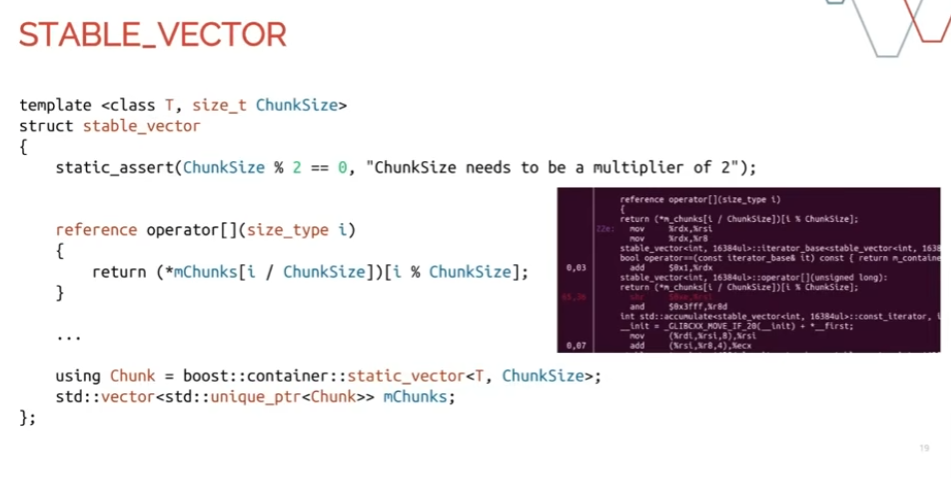

# Stable Vector：为什么使用 `unique_ptr<fixed-size chunk>`



这一页展示的是前面 Instrument Store 中 custom `stable_vector`
的实现思路。

核心代码：

``` cpp
template <class T, size_t ChunkSize>
struct stable_vector {
    static_assert(ChunkSize % 2 == 0,
                  "ChunkSize needs to be a multiplier of 2");

    reference operator[](size_type i) {
        return (*mChunks[i / ChunkSize])[i % ChunkSize];
    }

    using Chunk =
        boost::container::static_vector<T, ChunkSize>;

    std::vector<std::unique_ptr<Chunk>> mChunks;
};
```

最重要的结构是：

``` cpp
std::vector<std::unique_ptr<Chunk>> mChunks;
```

可以把整个 `stable_vector` 理解成：

> **vector of pointers to fixed-capacity contiguous chunks**

------------------------------------------------------------------------

## 1. 和普通 `std::vector<T>` 有什么区别？

普通 vector：

``` cpp
std::vector<Instrument> instruments;
```

概念上：

``` text
vector
  │
  ▼
[A][B][C][D]
```

如果 capacity 不够，vector 需要重新申请更大的连续内存：

``` text
OLD:

0x1000
[A][B][C][D]


NEW:

0x9000
[A][B][C][D][E][ ][ ][ ]
```

原来的 A/B/C/D 会被 move/copy 到新地址。

因此之前保存的：

``` cpp
Instrument* p = &instruments[0];
```

可能变成 dangling pointer。

这不满足 Instrument Store 的：

> **stable pointers / stable references**

------------------------------------------------------------------------

# 2. Stable Vector 的第一个变化：外层存 `unique_ptr`

Stable vector 不直接存 Instrument，而是：

``` cpp
std::vector<std::unique_ptr<Chunk>> mChunks;
```

例如：

``` text
mChunks

[ptr0][ptr1][ptr2]
   │     │     │
   ▼     ▼     ▼

 Chunk0 Chunk1 Chunk2
```

如果外层 vector capacity 不够：

``` text
OLD:

[ptr0][ptr1]

        ↓ outer vector reallocates

NEW:

[ptr0][ptr1][ptr2][ ][ ]
```

移动的是：

``` text
unique_ptr
```

而不是它指向的 Chunk。

Chunk 是独立分配的：

``` text
ptr0 ─────→ Chunk0 @ 0x5000
ptr1 ─────→ Chunk1 @ 0x8000
```

外层 vector reallocate 以后：

``` text
ptr0 ─────→ Chunk0 @ 0x5000
ptr1 ─────→ Chunk1 @ 0x8000
```

Chunk 地址没有改变。

因此 Chunk 中的 Instrument 也不会因为**外层 vector**扩容而移动。

------------------------------------------------------------------------

# 3. 第二个变化：每个 pointer 指向固定容量的 Chunk

假设：

``` cpp
ChunkSize = 4;
```

结构：

``` text
mChunks

[ptr0]        [ptr1]        [ptr2]
   │             │             │
   ▼             ▼             ▼

[A][B][C][D]  [E][F][G][H]  [I][ ][ ][ ]
   Chunk0         Chunk1         Chunk2
```

每个 Chunk 最多存 `ChunkSize` 个对象。

Chunk 满以后：

> **不扩大原来的 Chunk，而是创建新的 Chunk。**

例如：

``` text
开始：

Chunk0
[A][B][ ][ ]


继续：

Chunk0
[A][B][C][D]


再插入 E：

Chunk0          Chunk1
[A][B][C][D]    [E][ ][ ][ ]


继续：

Chunk0          Chunk1
[A][B][C][D]    [E][F][G][H]


再插入 I：

Chunk0          Chunk1          Chunk2
[A][B][C][D]    [E][F][G][H]    [I][ ][ ][ ]
```

已有的 A-H 永远不需要因为增长而搬家。

------------------------------------------------------------------------

# 4. 为什么不能让 Chunk 直接是普通 `std::vector<T>`？

例如：

``` cpp
std::vector<std::unique_ptr<std::vector<T>>> mChunks;
```

外层确实已经 stable：

``` text
outer vector
[ptr0][ptr1]
   │     │
   ▼     ▼
vector  vector
```

外层 reallocation 只移动 `unique_ptr`，不会移动内部 vector 对象。

但是：

> **内部 `std::vector<T>` 自己仍然可能 reallocate。**

例如：

``` text
ptr0
 ↓
vector<T>

capacity = 4

[A][B][C][D]
```

现在：

``` cpp
mChunks[0]->push_back(E);
```

内部 vector capacity 不够：

``` text
OLD:

[A][B][C][D]
 ↑
 p


NEW:

[A][B][C][D][E][ ][ ][ ]
```

A/B/C/D 本身搬家。

于是：

``` cpp
T* p = &(*mChunks[0])[0];
```

仍然会失效。

因此这个设计其实需要保证**两层稳定性**：

``` text
第一层：

vector<unique_ptr<Chunk>>
        ↓
外层可以 reallocate
        ↓
只移动 pointer
        ↓
Chunk 不移动 ✓


第二层：

Chunk
        ↓
内部不能 reallocate
        ↓
T 不移动 ✓
```

------------------------------------------------------------------------

# 5. 普通 vector + `reserve(ChunkSize)` 可以吗？

理论上可以。

例如：

``` cpp
auto chunk = std::make_unique<std::vector<T>>();
chunk->reserve(ChunkSize);
```

然后严格保证：

``` cpp
if (chunk->size() == ChunkSize) {
    // 不再往这个 vector 插入
    // 创建一个新的 chunk
}
```

那么：

``` text
capacity = ChunkSize
```

在没有超过 capacity 的情况下，内部 vector 不会
reallocate，因此已有元素地址也不会改变。

所以：

> `std::vector<T> + reserve(ChunkSize)` 技术上可以实现同样的基本思想。

但是这依赖程序员一直维护：

``` text
size <= ChunkSize
```

这个 invariant。

`static_vector<T, ChunkSize>` 则直接把：

> **这个 Chunk 的最大容量就是 ChunkSize**

表达在类型中，因此更加明确。

------------------------------------------------------------------------

# 6. 为什么不直接用 `std::array<T, ChunkSize>`？

也可以。

例如：

``` cpp
using Chunk = std::array<T, ChunkSize>;

std::vector<std::unique_ptr<Chunk>> mChunks;
```

同样具有：

``` text
fixed storage
     ↓
no reallocation
     ↓
stable T*
```

结构仍然是：

``` text
[ptr0]        [ptr1]
   │             │
   ▼             ▼

[A][B][C][D]  [E][F][G][H]
```

所以从**地址稳定性**来说，`array` 完全可以。

------------------------------------------------------------------------

# 7. `array` 和 `static_vector` 的关键区别

区别在于：

``` cpp
std::array<T, 1024>
```

表示：

> **从创建 array 的时候开始，就存在 1024 个 T 对象。**

也就是：

``` text
capacity = 1024
number of constructed T objects = 1024
```

即使实际上只需要三个 Instrument：

``` text
[A][B][C][default T][default T][default T]...
```

其他对象也已经被构造。

通常还需要自己额外维护：

``` cpp
size_t used = 0;
```

例如：

``` cpp
struct Chunk {
    std::array<T, ChunkSize> data;
    size_t used = 0;
};
```

------------------------------------------------------------------------

## 8. `static_vector` 是固定 capacity，但动态 size

`static_vector<T, 1024>` 更接近普通 vector 的语义：

``` text
capacity = 1024
size     = 0 ~ 1024
```

例如刚创建：

``` text
[ raw storage........................ ]
size = 0
```

插入 A：

``` text
[A][ raw storage..................... ]
size = 1
```

插入 B、C：

``` text
[A][B][C][ raw storage............... ]
size = 3
```

后面的空间存在，但里面还没有真正构造 `T`。

调用：

``` cpp
chunk.emplace_back(args...);
```

才会在对应位置构造新的 `T`。

所以：

``` text
std::array<T, N>

capacity = N
constructed objects = N


static_vector<T, N>

capacity = N
constructed objects = current size
```

这就是作者使用 `static_vector` 而不是 `array` 的主要原因之一。

------------------------------------------------------------------------

# 9. 如果 T 很简单，array 完全可以

例如：

``` cpp
struct Instrument {
    int id;
    int price;
};
```

默认构造非常便宜。

那么：

``` cpp
std::array<Instrument, ChunkSize>
```

配合：

``` cpp
size_t used;
```

完全可以自己实现 Chunk。

但如果 T 比较复杂：

``` cpp
struct Instrument {
    std::string symbol;
    PricingModel model;
    MarketData data;
};
```

创建：

``` cpp
std::array<Instrument, 1024>
```

意味着一次构造 1024 个 Instrument，即使当前只需要几个。

`static_vector` 可以避免这些不必要的对象构造。

------------------------------------------------------------------------

# 10. `operator[]` 为什么是 `/` 和 `%`？

代码：

``` cpp
reference operator[](size_type i) {
    return (*mChunks[i / ChunkSize])[i % ChunkSize];
}
```

因为 global index 要拆成：

``` text
哪个 Chunk？
+
Chunk 里面第几个？
```

例如：

``` text
ChunkSize = 4

Chunk0          Chunk1          Chunk2
[A][B][C][D]    [E][F][G][H]    [I][J][K][L]

index:
 0  1  2  3      4  5  6  7      8  9 10 11
```

访问：

``` cpp
v[6];
```

计算：

``` text
chunk index = 6 / 4 = 1
offset      = 6 % 4 = 2
```

所以：

``` text
Chunk1[2]
   ↓
   G
```

也就是：

``` cpp
(*mChunks[1])[2];
```

------------------------------------------------------------------------

# 11. 为什么 ChunkSize 常常希望是 power of two？

如果：

``` text
ChunkSize = 1024 = 2^10
```

那么：

``` cpp
i / 1024
i % 1024
```

编译器通常可以转换成很便宜的 bit operation：

``` cpp
chunk  = i >> 10;
offset = i & 1023;
```

因此 chunk lookup 可以比较便宜。

注意 slide 中：

``` cpp
static_assert(ChunkSize % 2 == 0);
```

只保证 ChunkSize 是偶数，并**没有真正保证 power-of-two**。

如果设计确实要求 power-of-two，更严格可以写：

``` cpp
static_assert(
    ChunkSize != 0 &&
    (ChunkSize & (ChunkSize - 1)) == 0
);
```

------------------------------------------------------------------------

# 12. 为什么它的 cache locality 仍然不错？

如果每个 Instrument 单独分配：

``` cpp
std::vector<std::unique_ptr<Instrument>>
```

可能是：

``` text
ptr0 ───────────────→ A

ptr1 ─────────────────────────→ B

ptr2 ─────→ C
```

每个对象可能位于 heap 的不同位置。

而 Chunk 设计：

``` text
Chunk0

[A][B][C][D][E][F][G]...
```

Chunk 内对象是连续的。

所以遍历一个 Chunk 时具有良好的 spatial locality。

不过要注意：

> **整个 stable_vector 并不是全局 contiguous。**

准确结构是：

``` text
Chunk0
[A][B][C][D]

           Chunk1
           [E][F][G][H]

                       Chunk2
                       [I][J][K][L]
```

Chunk 之间可以位于不同 memory address。

因此更准确地说：

> **chunk 内 contiguous，整个 container 是 segmented/chunked storage。**

------------------------------------------------------------------------

# 13. 为什么 iterator 会有额外 overhead？

普通：

``` cpp
std::vector<T>
```

访问：

``` cpp
v[i]
```

地址基本可以直接计算：

``` text
base_address + i * sizeof(T)
```

而 stable vector：

``` text
i
↓
i / ChunkSize
↓
mChunks[chunk]
↓
dereference pointer
↓
i % ChunkSize
↓
element
```

多了一层 indirection。

Iterator 还可能需要处理：

``` text
当前 Chunk 内继续走
        ↓
走到 Chunk 尾部？
        ↓ yes
切换到下一个 Chunk
```

因此相比真正的 `std::vector`，iterator/index operation
会有一些额外成本。

这是用：

``` text
stable addresses
+
dynamic growth
+
good locality
```

换来的 trade-off。

------------------------------------------------------------------------

# 14. 最终结构

整个设计可以记成：

``` text
                 stable_vector
                      │
                      ▼
       std::vector<std::unique_ptr<Chunk>>
                      │
          ┌───────────┼───────────┐
          │           │           │
          ▼           ▼           ▼

       Chunk0       Chunk1       Chunk2
     fixed cap.   fixed cap.   fixed cap.

    [A][B][C][D] [E][F][G][H] [I][J][ ][ ]
```

增长时：

``` text
Chunk 满
   ↓
new Chunk
   ↓
outer vector 加一个 unique_ptr
   ↓
已有 Chunk 不移动
   ↓
已有 Instrument 不移动
   ↓
Instrument* / Instrument& 保持有效
```

------------------------------------------------------------------------

# 15. 最重要的结论

这个 custom `stable_vector` 相比普通
`std::vector<T>`，核心就是两个变化：

### 第一：外层存 pointer

``` cpp
std::vector<std::unique_ptr<Chunk>>
```

外层 vector reallocation 时只移动 pointer，不移动真正的数据。

### 第二：pointer 指向固定容量的 Chunk

``` cpp
static_vector<T, ChunkSize>
```

Chunk 自己不会动态扩容，因此内部已有的 `T` 不会搬家。

最终达到：

``` text
stable pointer/reference
        +
dynamic growth
        +
good chunk-level cache locality
```

可以把它浓缩成一句：

> **不要移动真正的 T；增长时只增加新的 fixed-size chunk，并允许外层的
> pointers 移动。**

`std::array<T, ChunkSize>` 也能保证地址稳定；作者选择
`static_vector`，主要因为它提供了更自然的：

> **fixed capacity + dynamic size**

语义，只构造真正插入的 `T`。
